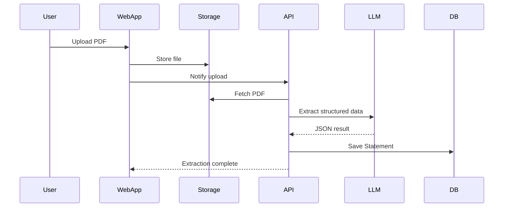
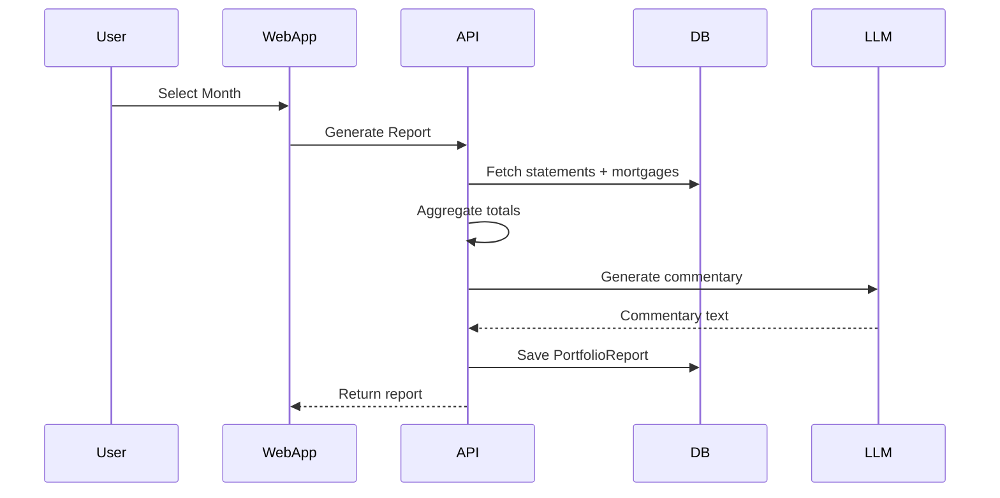

# Technial Specification Document

---

# Tech Stack

## Application

- **Framework**: Next.js (App Router)
- **Language**: TypeScript
- **Runtime**: Node 20 (Vercel default)
- **Package Manager**: pnpm
- **UI**: TailwindCSS + shadcn/ui
- **Architecture**: Single repo (single Next.js app)

---

## Backend

- **API Layer**: Next.js API routes (serverless)
- **ORM**: Drizzle ORM
- **Database**: Supabase Postgres
- **Auth**: Supabase Auth (magic link)
- **Storage**: Supabase Storage (PDFs)

---

## AI & Parsing

- **LLM Provider**: OpenAI
- **Integration**: Vercel AI SDK
  - `generateObject()` → structured PDF extraction
  - `generateText()` → commentary
- **PDF Parsing**: `pdf-parse` → raw text → LLM extraction
- **No RAG**
- **No vector DB**

---

## Deployment & Infra

- **Hosting**: Vercel (Free Tier)
- **Domain**: `yourapp.vercel.app`
- **Database Hosting**: Supabase (Free Tier)
- **Storage**: Supabase bucket
- **No Docker**
- **No background jobs (V1)**
- **No queues**

---

# Repository Structure

Single Next.js app:

```
/app
  /dashboard
  /reports
  /upload
  /api
    /statements
    /reports
    /extract
/lib
  /db
  /llm
  /parsing
  /reporting
  /validation
/components
  /ui
  /reports
  /upload
/drizzle
  schema.ts
  migrations/
/types
```

Clear boundary:

UI → API → Business Logic → DB

---

# Key Flows (Mermaid)

## Upload & Extraction Flow





# Database Schema

```typescript
// drizzle/schema.ts

import {
  pgTable,
  uuid,
  text,
  numeric,
  timestamp,
  date,
  jsonb,
  varchar,
} from "drizzle-orm/pg-core";

export const users = pgTable("users", {
  id: uuid("id").primaryKey(),
  email: varchar("email", { length: 255 }).notNull(),
  createdAt: timestamp("created_at").defaultNow(),
});

export const properties = pgTable("properties", {
  id: uuid("id").primaryKey(),
  userId: uuid("user_id").notNull(),
  address: text("address").notNull(),
  nickname: text("nickname"),
  createdAt: timestamp("created_at").defaultNow(),
});

export const statements = pgTable("statements", {
  id: uuid("id").primaryKey(),
  propertyId: uuid("property_id").notNull(),
  periodStart: date("period_start").notNull(),
  periodEnd: date("period_end").notNull(),
  assignedMonth: varchar("assigned_month", { length: 7 }).notNull(), // YYYY-MM
  rent: numeric("rent").notNull(),
  expenses: numeric("expenses").notNull(),
  rawJson: jsonb("raw_json").notNull(),
  pdfUrl: text("pdf_url").notNull(),
  createdAt: timestamp("created_at").defaultNow(),
});

export const mortgageEntries = pgTable("mortgage_entries", {
  id: uuid("id").primaryKey(),
  propertyId: uuid("property_id").notNull(),
  month: varchar("month", { length: 7 }).notNull(), // YYYY-MM
  amount: numeric("amount").notNull(),
  createdAt: timestamp("created_at").defaultNow(),
});

export const portfolioReports = pgTable("portfolio_reports", {
  id: uuid("id").primaryKey(),
  userId: uuid("user_id").notNull(),
  month: varchar("month", { length: 7 }).notNull(),
  totalsJson: jsonb("totals_json").notNull(),
  flagsJson: jsonb("flags_json").notNull(),
  aiCommentary: text("ai_commentary"),
  version: numeric("version").notNull(),
  createdAt: timestamp("created_at").defaultNow(),
});
```
