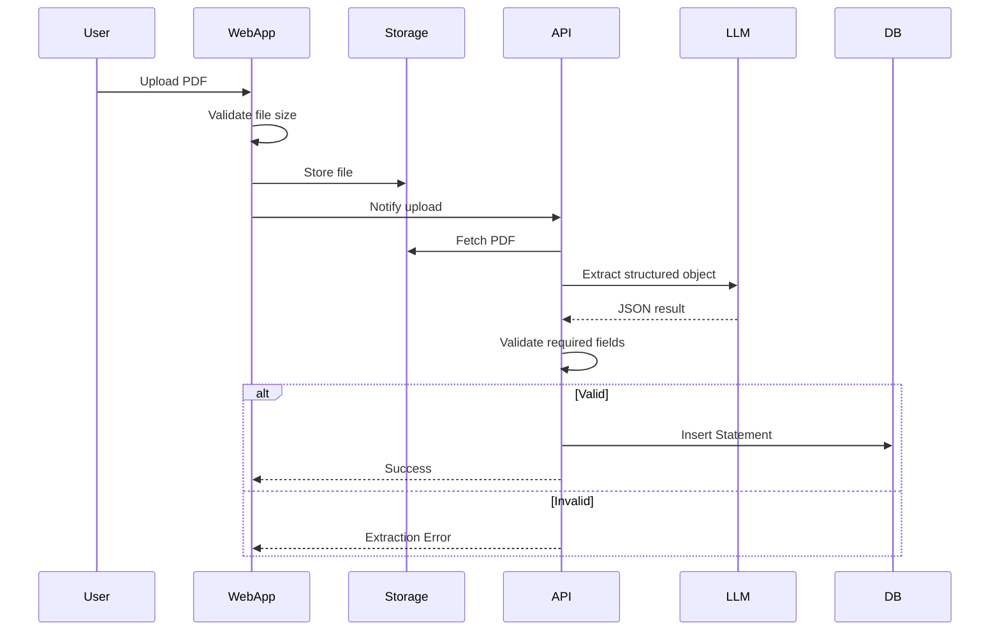
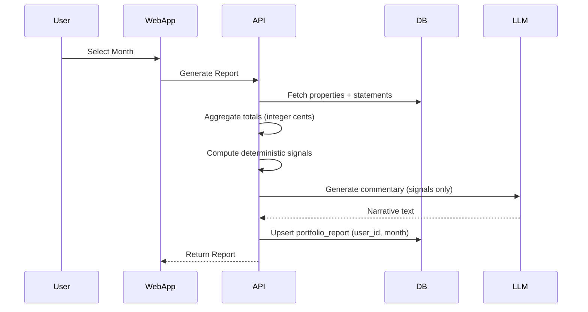

# Technial Specification Document

---

# Tech Stack

## Application

- **Framework**: Next.js (App Router)
- **Language**: TypeScript
- **Runtime**: Node 20 (Vercel default)
- **Package Manager**: pnpm
- **UI**: TailwindCSS + shadcn/ui
- **Architecture**: Single repo (single Next.js app)

---

## Backend

- **API Layer**: Next.js API routes (serverless)
- **ORM**: Drizzle ORM
- **Database**: Supabase Postgres
- **Auth**: Supabase Auth (magic link)
- **Storage**: Supabase Storage (PDFs)

Notes:

- Supabase Auth `auth.users` is the source of truth for users.
- No custom `users` table in V1.

---

## AI & Parsing

- **LLM Provider**: OpenAI
- **Integration**: Vercel AI SDK
  - `generateObject()` → structured PDF extraction
  - `generateText()` → commentary

- **PDF Parsing**: `pdf-parse` → raw text → LLM extraction
- **No RAG**
- **No vector DB**

Constraints:

- Enforce PDF size limit (e.g. 5MB max) at upload.
- Hard validation: required fields must be present or extraction fails.

---

## Deployment & Infra

- **Hosting**: Vercel (Free Tier)
- **Domain**: `yourapp.vercel.app`
- **Database Hosting**: Supabase (Free Tier)
- **Storage**: Supabase bucket
- **No Docker**
- **No background jobs (V1)**
- **No queues**

---

# Repository Structure

Single Next.js app:

```
/app
  /dashboard
  /reports
  /upload
  /api
    /statements
    /reports
    /extract
/lib
  /db
  /llm
  /parsing
  /reporting
  /validation
/components
  /ui
  /reports
  /upload
/drizzle
  schema.ts
  migrations/
/types
```

Clear boundary:

UI → API → Business Logic → DB

---

# Key Flows (Mermaid)

## Upload & Extraction Flow





# Database Schema

All monetary values stored as **integer cents**.

```typescript
// drizzle/schema.ts

import {
  pgTable,
  boolean,
  uuid,
  text,
  integer,
  timestamp,
  date,
  jsonb,
  varchar,
} from "drizzle-orm/pg-core";

export const properties = pgTable("properties", {
  id: uuid("id").primaryKey(),
  userId: uuid("user_id").notNull(), // references auth.users
  address: text("address").notNull(),
  nickname: text("nickname"),
  monthlyMortgageCents: integer("monthly_mortgage_cents").notNull().default(0),
  mortgageProvided: boolean().notNull().default(false),
  createdAt: timestamp("created_at").defaultNow(),
});

export const statements = pgTable("statements", {
  id: uuid("id").primaryKey(),
  fileHash: text("file_hash").notNull(), // de-dupe
  propertyId: uuid("property_id").notNull(),
  periodStart: date("period_start").notNull(),
  periodEnd: date("period_end").notNull(),
  assignedMonth: varchar("assigned_month", { length: 7 }).notNull(), // YYYY-MM
  rentCents: integer("rent_cents").notNull(),
  expensesCents: integer("expenses_cents").notNull(),
  rawJson: jsonb("raw_json").notNull(),
  pdfUrl: text("pdf_url").notNull(),
  createdAt: timestamp("created_at").defaultNow(),
});

export const portfolioReports = pgTable("portfolio_reports", {
  id: uuid("id").primaryKey(),
  userId: uuid("user_id").notNull(),
  month: varchar("month", { length: 7 }).notNull(),
  totalsJson: jsonb("totals_json").notNull(),
  flagsJson: jsonb("flags_json").notNull(),
  aiCommentary: text("ai_commentary"),
  createdAt: timestamp("created_at").defaultNow(),
});
```

Constraints (to implement in migrations):

- Unique: `(property_id, assigned_month, period_end)` on statements
- Unique: `(user_id, month)` on portfolio_reports

Notes:

- Regenerating a report overwrites the existing `(user_id, month)` record.
- No mortgage_entries table in V1.
- No report versioning in V1.

---

# Key Logic Rules

## Expected Statements

Expected properties for a month = total properties registered for the user.

No start/end active tracking in V1.

## Mortgage Logic

- Mortgage is fixed per property (`monthlyMortgageCents`).
- Included every month, regardless of statement presence.
- If 0 → explicitly flagged in report.

## Month Assignment

- Month determined by statement `periodEnd`.
- Multiple statements in same month → summed.

## Report Regeneration

- If report exists for `(user_id, month)` → overwrite.
- Reports are not versioned in V1.

---

# Upload & Extraction Flow (Serverless Safe)

- Enforce PDF size limit before storage.
- Parse PDF → extract structured object via LLM.
- Validate required fields.
- If validation fails → return explicit error.
- Save statement.

No background jobs.
No async queue.

All operations must complete within Vercel serverless timeout limits.
