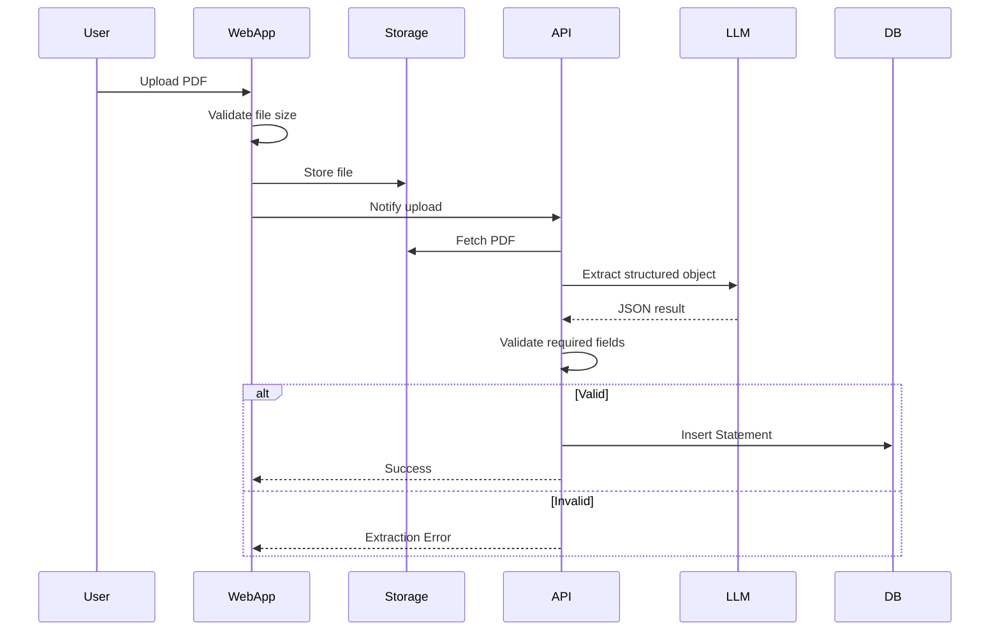
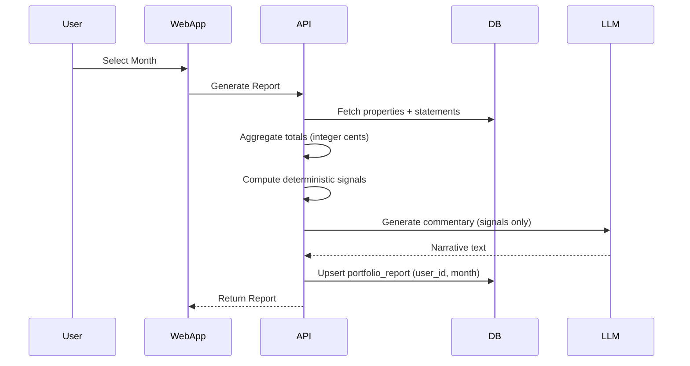

# Technial Specification Document

---

# Tech Stack

## Application

- **Framework**: Next.js (App Router)
- **Language**: TypeScript
- **Runtime**: Node 20 (Vercel default)
- **Package Manager**: pnpm
- **UI**: TailwindCSS + shadcn/ui
- **Architecture**: Single repo (single Next.js app)

---

## Backend

- **API Layer**: Next.js API routes (serverless)
- **ORM**: Drizzle ORM
- **Database**: Supabase Postgres
- **Auth**: Supabase Auth (magic link)
- **Storage**: Supabase Storage (PDFs)

Notes:

- Supabase Auth `auth.users` is the source of truth for users.
- No custom `users` table in V1.

---

## AI & Parsing

- **LLM Provider**: OpenAI
- **Integration**: Vercel AI SDK
  - `generateObject()` → structured PDF extraction
  - `generateText()` → commentary

- **PDF Parsing**: `pdf-parse` → raw text → LLM extraction
- **No RAG**
- **No vector DB**

Constraints:

- Enforce PDF size limit (e.g. 5MB max) at upload.
- Hard validation: required fields must be present or extraction fails.

---

## Deployment & Infra

- **Hosting**: Vercel (Free Tier)
- **Domain**: `yourapp.vercel.app`
- **Database Hosting**: Supabase (Free Tier)
- **Storage**: Supabase bucket
- **No Docker**
- **No background jobs (V1)**
- **No queues**

---

# Repository Structure

Single Next.js app:

```
/app
  /dashboard
  /reports
  /upload
  /api
    /statements
    /reports
    /extract
/lib
  /db
  /llm
  /parsing
  /reporting
  /validation
/components
  /ui
  /reports
  /upload
/drizzle
  schema.ts
  migrations/
/types
```

Clear boundary:

UI → API → Business Logic → DB

---

# Key Flows (Mermaid)

## Upload & Extraction Flow





# Database Schema

All monetary values stored as **integer cents**.

```typescript
// drizzle/schema.ts

import {
  pgTable,
  uuid,
  text,
  timestamp,
  date,
  numeric,
  pgEnum,
  varchar,
  index,
} from "drizzle-orm/pg-core";

//
// ENUMS
//

export const transactionCategoryEnum = pgEnum("transaction_category", [
  // Income
  "rent",

  // Property expenses
  "insurance",
  "rates",
  "repairs",
  "property_management",
  "utilities",
  "strata_fees",
  "other_expense",

  // Loan-related
  "loan_payment",
]);

//
// USERS
//

export const users = pgTable("users", {
  id: uuid("id").primaryKey().defaultRandom(),
  auth_user_id: uuid("auth_user_id").notNull().unique(), // Supabase auth.users.id
  email: varchar("email", { length: 255 }).notNull(),
  createdAt: timestamp("created_at").defaultNow().notNull(),
});

//
// PROPERTIES
//

export const properties = pgTable(
  "properties",
  {
    id: uuid("id").primaryKey().defaultRandom(),

    userId: uuid("user_id")
      .notNull()
      .references(() => users.id, { onDelete: "cascade" }),

    address: text("address").notNull(),

    createdAt: timestamp("created_at").defaultNow().notNull(),
  },
  (table) => ({
    userIdx: index("idx_properties_user").on(table.userId),
  }),
);

//
// SOURCE DOCUMENTS (PM PDFs, etc)
//

export const sourceDocuments = pgTable(
  "source_documents",
  {
    id: uuid("id").primaryKey().defaultRandom(),
    userId: uuid("user_id")
      .notNull()
      .references(() => users.id, { onDelete: "cascade" }),

    fileName: text("file_name").notNull(),
    fileHash: text("file_hash").notNull(), // SHA-256
    filePath: text("file_path").notNull(),
    uploadedAt: timestamp("uploaded_at").defaultNow().notNull(),
  },
  (table) => ({
    userIdx: index("idx_source_docs_user").on(table.userId),
  }),
);

//
// TRANSACTIONS (Ledger)
//

export const transactions = pgTable(
  "transactions",
  {
    id: uuid("id").primaryKey().defaultRandom(),

    userId: uuid("user_id")
      .notNull()
      .references(() => users.id, { onDelete: "cascade" }),

    propertyId: uuid("property_id").references(() => properties.id, {
      onDelete: "set null",
    }),

    // Optional link to source document
    sourceDocumentId: uuid("source_document_id"),

    transactionDate: date("transaction_date").notNull(),

    // Store money as DECIMAL(15,2)
    amount: numeric("amount", { precision: 15, scale: 2 }).notNull(),

    // Explicit category
    category: transactionCategoryEnum("category").notNull(),

    description: text("description"),

    // Canonical month bucket YYYY-MM
    assignedMonth: varchar("assigned_month", { length: 7 }).notNull(),

    notes: text("notes"),

    createdAt: timestamp("created_at").defaultNow().notNull(),
  },
  (table) => ({
    userIdx: index("idx_transactions_user").on(table.userId),
    idxUserMonth: index("idx_transactions_user_month").on(
      table.userId,
      table.assignedMonth,
    ),
    idxPropertyMonth: index("idx_transactions_property_month").on(
      table.propertyId,
      table.assignedMonth,
    ),
    idxSourceDoc: index("idx_transactions_source_document").on(
      table.sourceDocumentId,
    ),
  }),
);

//
// PORTFOLIO REPORT SNAPSHOT
//

export const portfolioReports = pgTable(
  "portfolio_reports",
  {
    id: uuid("id").primaryKey().defaultRandom(),
    userId: uuid("user_id")
      .notNull()
      .references(() => users.id, { onDelete: "cascade" }),
    month: varchar("month", { length: 7 }).notNull(), // YYYY-MM

    totalsJson: text("totals_json").notNull(), // Snapshot of computed totals
    flagsJson: text("flags_json").notNull(),
    aiCommentary: text("ai_commentary"),

    version: numeric("version").notNull(),
    createdAt: timestamp("created_at").defaultNow().notNull(),
  },
  (table) => ({
    userIdx: index("idx_reports_user").on(table.userId),
    idxUserMonth: index("idx_reports_user_month").on(table.userId, table.month),
  }),
);
```

Constraints (to implement in migrations):

- Unique: `(property_id, assigned_month, period_end)` on statements
- Unique: `(user_id, month)` on portfolio_reports

Notes:

- Regenerating a report overwrites the existing `(user_id, month)` record.
- No report versioning in V1.

---

# Key Logic Rules

## Expected Statements

Expected properties for a month = total properties registered for the user.

No start/end active tracking in V1.

## Loan Payment Logic

- User will input total loan payment amount per property per month.
- Stretch: pre-fill the input from the most recent payment
- If 0 → explicitly flagged in report.

## Month Assignment

- User selects month.

## Report Regeneration

- If report exists for `(user_id, month)` → overwrite.
- Reports are not versioned in V1.

---

# Upload & Extraction Flow (Serverless Safe)

- Enforce PDF size limit before storage.
- Parse PDF → extract structured object via LLM.
- Validate required fields.
- If validation fails → return explicit error.
- Save statement.

No background jobs.
No async queue.

All operations must complete within Vercel serverless timeout limits.
