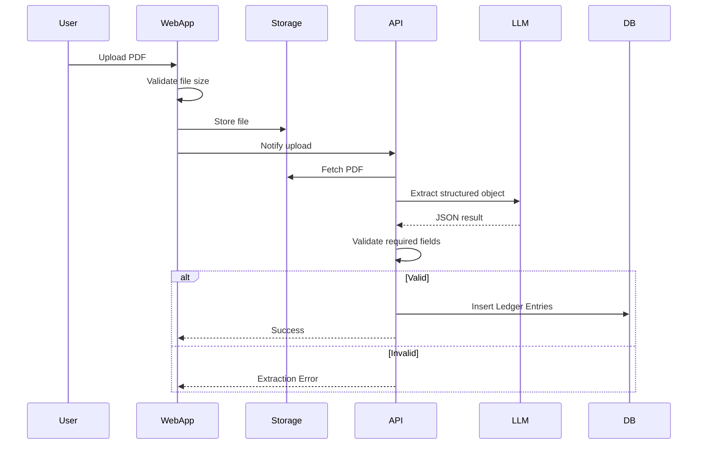
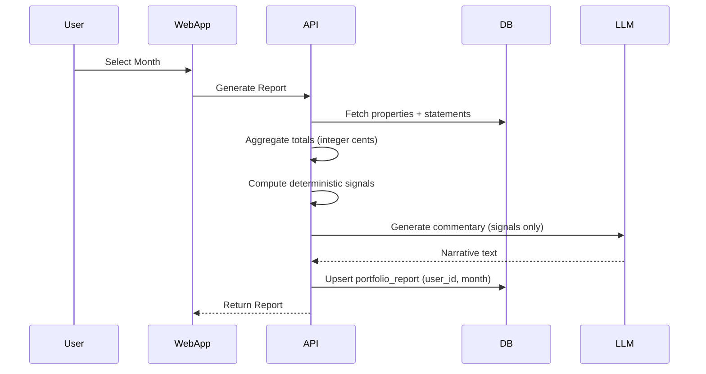

# Technial Specification Document

---

# Tech Stack

## Application

- **Framework**: Next.js (App Router)
- **Language**: TypeScript
- **Runtime**: Node 20 (Vercel default)
- **Package Manager**: pnpm
- **UI**: TailwindCSS + shadcn/ui
- **Architecture**: Single repo (single Next.js app)

---

## Backend

- **API Layer**: Next.js API routes (serverless)
- **ORM**: Drizzle ORM
- **Database**: Supabase Postgres
- **Auth**: Supabase Auth (magic link)
- **Storage**: Supabase Storage (PDFs)

Notes:

- Supabase Auth `auth.users` is the source of truth for users.
- No custom `users` table in V1.

---

## AI & Parsing

- **LLM Provider**: OpenAI
- **Integration**: Vercel AI SDK
  - `generateObject()` → structured PDF extraction
  - `generateText()` → commentary

- **PDF Parsing**: `pdf-parse` → raw text → LLM extraction
- **No RAG**
- **No vector DB**

Constraints:

- Enforce PDF size limit (e.g. 5MB max) at upload.
- Hard validation: required fields must be present or extraction fails.

---

## Deployment & Infra

- **Hosting**: Vercel (Free Tier)
- **Domain**: `yourapp.vercel.app`
- **Database Hosting**: Supabase (Free Tier)
- **Storage**: Supabase bucket
- **No Docker**
- **No background jobs (V1)**
- **No queues**

---

# Repository Structure

Single Next.js app:

```
/app
  /dashboard
  /reports
  /upload
  /api
    /statements
    /reports
    /extract
/lib
  /db
  /llm
  /parsing
  /reporting
  /validation
/components
  /ui
  /reports
  /upload
/drizzle
  schema.ts
  migrations/
/types
```

Clear boundary:

UI → API → Business Logic → DB

---

# Key Flows (Mermaid)

## Upload & Extraction Flow





# Database Schema

Tables:

- properties.user_id → users.id
- ledger_entries.user_id → users.id
- portfolio_reports.user_id → users.id
- source_documents.user_id → users.id

Notes:

- (Row Level Security)[https://supabase.com/docs/guides/database/postgres/row-level-security] enabled.
- All monetary values stored as positive **integer cents**, including expenses.
- Regenerating a report overwrites the existing `(user_id, month)` record.

---

# Key Logic Rules

## Expected Statements

Expected properties for a month = total properties registered for the user.

No start/end active tracking in V1.

## Loan Payment Logic

- User will input total loan payment amount per property per month.
- Stretch: pre-fill the input from the most recent payment
- If 0 → explicitly flagged in report.

## Month Assignment

- User selects month.

## Report Regeneration

- If report exists for `(user_id, month)` → overwrite.
- Reports are not versioned in V1.

---

# Upload & Extraction Flow (Serverless Safe)

- Enforce PDF size limit before storage.
- Parse PDF → extract structured object via LLM.
- Validate required fields.
- If validation fails → return explicit error.
- Save statement.

No background jobs.
No async queue.

All operations must complete within Vercel serverless timeout limits.
