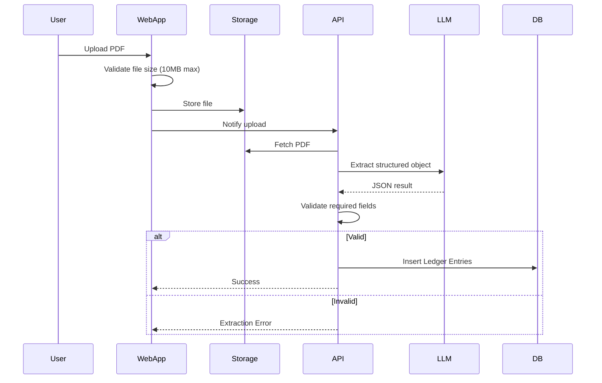
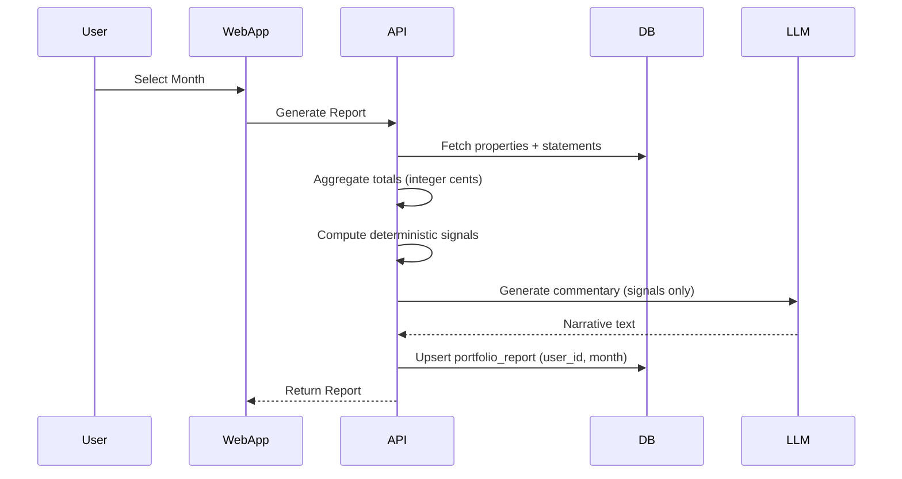

# Technical Specification Document

# Tech Stack

## Application

- **Framework**: Next.js (App Router)
- **Language**: TypeScript
- **Runtime**: Node 20 (Vercel default)
- **Package Manager**: pnpm
- **UI**: TailwindCSS + shadcn/ui
- **Architecture**: Single repo (single Next.js app)

## Backend

- **API Layer**: Next.js API routes (serverless)
- **ORM**: Drizzle ORM
- **Database**: Supabase Postgres
- **Auth**: Supabase Auth (magic link / OTP)
- **Storage**: Supabase Storage (PDFs)

Notes:

- Supabase Auth `auth.users` is the source of truth for users.
- No custom `users` table in V1.

## AI & Parsing

- **LLM Provider**: Anthropic (via Vercel AI SDK gateway)
  - Extraction: `anthropic/claude-sonnet-4-5`
  - Commentary: `claude-haiku-4-5-20251001`
- **Integration**: Vercel AI SDK
  - `generateObject()` → structured PDF extraction
  - `generateText()` → commentary

- **PDF Parsing**: `pdf-parse` → raw text → LLM extraction
- **No RAG**
- **No vector DB**

Constraints:

- Enforce PDF size limit (10MB max) at upload.
- Hard validation: required fields must be present or extraction fails.

## Deployment & Infra

- **Hosting**: Vercel (Free Tier)
- **Domain**: `yourapp.vercel.app`
- **Database Hosting**: Supabase (Free Tier)
- **Storage**: Supabase bucket
- **No Docker**
- **No background jobs (V1)**
- **No queues**

# Repository Structure

Single Next.js app:

```
/app
  /dashboard
  /reports/[month]
  /upload
  /properties
  /onboarding
  /login
  /auth/callback
  /api
    /upload
    /extract
    /statements
    /reports
    /properties
    /auth/signout
/lib
  /extraction/      — PDF text extraction + LLM schema + parse
  /reports/         — compute.ts (totals/flags), commentary.ts (AI narrative)
  /supabase/        — browser + server clients
  db.ts             — Drizzle client
  format.ts         — formatCents, formatMonth, recentMonths
  logger.ts         — LOG_LEVEL-gated debug/info/error
/components
  /ui               — shadcn primitives
  app-nav.tsx       — top nav with user avatar + sign-out
/db
  schema.ts         — Drizzle table definitions + exported types
/drizzle
  migrations/       — SQL files applied via pnpm db:migrate
/playwright
  setup.ts          — auth setup (creates test user, saves storageState)
  fixtures.ts       — createTestUser / deleteTestUser / getTestSession helpers
  /tests            — E2E specs
/__tests__          — Vitest unit tests (*.test.ts)
```

Clear boundary:

UI → API → Business Logic → DB

# Key Flows (Mermaid)

## Upload & Extraction Flow





# Database Schema

Tables:

- properties.user_id → users.id
- ledger_entries.user_id → users.id
- portfolio_reports.user_id → users.id
- source_documents.user_id → users.id

Notes:

- [Row Level Security](https://supabase.com/docs/guides/database/postgres/row-level-security) enabled.
- All monetary values stored as positive **integer cents**, including expenses.
- Regenerating a report overwrites the existing `(user_id, month)` record; `version` increments and `updated_at` is refreshed. No version history is stored.

# Supabase Bucket Structure

```
documents/
  {userId}/
    pm_statements/
      smith-st-march-2026.pdf
```

# Key Logic Rules

## Expected Statements

Expected properties for a month = total properties registered for the user.

No start/end active tracking in V1.

## Loan Payment Logic

- User inputs total loan payment amount per property per month on the upload page.
- Loan payments are stored as `loan_payment` ledger entries scoped to the property and month — not as a field on the property record.
- If 0 → explicitly flagged in report.
- **Potential enhancement:** pre-fill the loan input from the most recent saved payment for that property, reducing repetitive entry each month.

## Month Assignment

- User selects month on the upload page.

## Report Regeneration

- If report exists for `(user_id, month)` → overwrite.
- `version` counter increments on each regeneration; `updated_at` timestamp is refreshed.
- No version history in V1 — only the latest generated version is stored.

---

# Upload & Extraction Flow (Serverless Safe)

- Enforce PDF size limit (10MB) before storage.
- Parse PDF → extract structured object via LLM.
- Validate required fields.
- If validation fails → return explicit error.
- Save statement.

No background jobs.
No async queue.

All operations must complete within Vercel serverless timeout limits.
